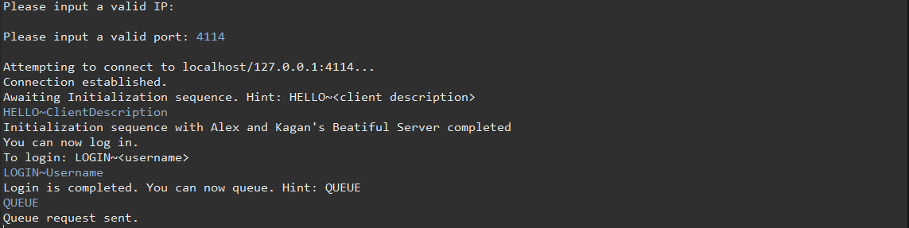
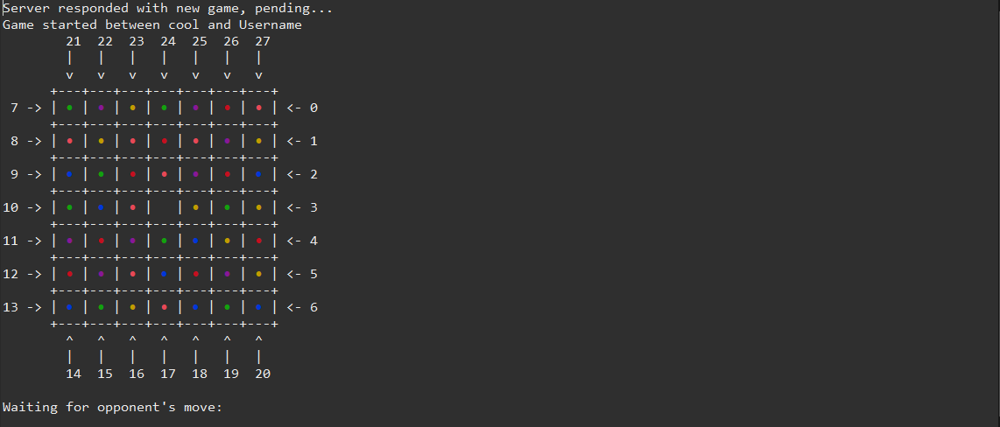
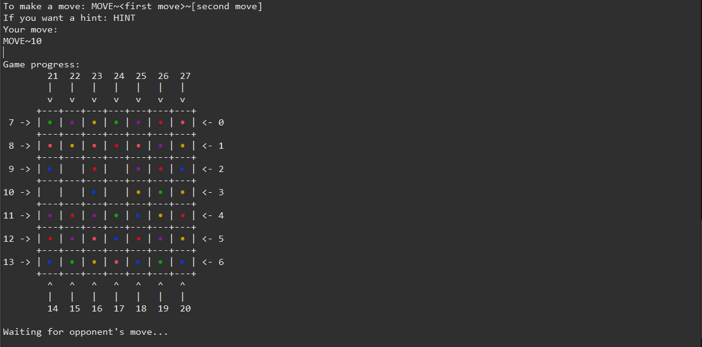

# A Multi-threaded Server/Client For Collecto

This project revolves around the board game Collecto and a networked approach to it with Java Socket programming. The project can be understood by its three main components. The first one being the game logic, the second one being the multithreaded server, and the last one being the multithreaded client. The project also contains strategies for the AIs and players for making the moves.

In this README file we will explain how you can play around with these components. To play a game you should also know the rules of Collecto, which can be read here (https://canvas.utwente.nl/courses/7181/files/2103028/download?wrap=1).

## Getting Started

Follow these instructions to run the server and the client to play Collecto.

### Prerequisites

You should install JDK 11 for builiding this application.

To run the unit tests you should install a Java IDE (we are recommending Eclipse and IntelliJ) and JUnit 5.

To view the Collecto board game, your preferred console should be able to work with ANSI escape codes. In Eclipse Marketplace you can install ANSI Escape in Console.

Links for the downloads respectively:
https://www.oracle.com/java/technologies/javase-jdk11-downloads.html
https://www.eclipse.org/downloads OR https://www.jetbrains.com/idea/download
https://junit.org/junit5
(if using eclipse) https://marketplace.eclipse.org/content/ansi-escape-console

### Building and Running (for Eclipse)

The zipped file CollectoYellow2.5, can be imported to Eclipse through File -> Import... -> Projects from Folder or Archive. Give the file location of the zipped file to the Import Source and press Finish.

Expand the src folder of your newly imported project.

To start the server expand the ss.project.server package and right-click on the CollectoServer.java file, then select the Run As option and press Java Application.

In the console you should type a valid port number (example: 4114, 8888).

Now to start the client expand the ss.project.client package and right-click on the ThreadedCollectoClient.java file, then select the Run As option and press Java Application.

(Another way to run the server and the client is through the Jar files located in the Executable Collecto directory. To run those jar files open up a command line prompt which supports ANSI escape codes and go the location of the Executable Collecto. Then type `java -jar CollectoServer.java` to run the server and type `java -jar CollectoClient.java` to run the client.)

If you are running the server on the same computer that you are running the client on, you can just leave the valid IP section empty and press enter. If the server is running on another computer you should enter that computer's IPv4 address to the valid IP section of the client and press enter.

Then in the valid port section you should enter the same port number that you decided on in the server application.

To play a game you should have two clients, for that you can simply repeat the last two steps.

Then for each client you should do a Hello handshake, this can be done by typing `HELLO` followed by `~` which is followed by a description for your client.

Now for each client you should also log in, this can be done by typing `LOGIN` followed by `~` which is followed by a <u>unique</u> name for your client. If you want to play as a simple AI, you should contain `AI` in your name (example: `KaganAI`), if you want to play as a smarter AI, you should contain `AI+` in your name (example: `AlexAI+`). 

After logging in you can queue for a game, this can be done by typing `QUEUE`. If you change your mind and want to exit the queue you can type `QUEUE` a second time. When two clients are queued and are waiting for a game, a new game will automatically start.

The moves are made by typing `MOVE` followed by `~` followed by the move number (for a single move), or `MOVE` followed by `~` followed by the first move number, followed by `~`, followed by the second move number (for a double move). Which rows and columns will be moved according to the game rules are shown in the TUI with numbers around the board and arrows pointing to the direction of the move.

If you struggle with finding a legal move, you can simply type `HINT` when it is your turn to play, and a legal move hint will be shown. You can do your move with that hint or discard it and pick another one.

When the game is over, the reason and the winner will be shown to the console. To play another game you can simply queue again by typing `QUEUE`.

A further note should be made that the CollectoServer can simultaneously run multiple games, meaning that you are not limited to two clients. To also see the clients that are logged in to the server you can type `LIST`.

After you played your games, you can type `EXIT` as the client and the program will terminate.

### Running the tests

To run the unit tests you need to have JUnit 5, for Eclipse you can simply right click on anyone of the Java files under the ss.project.test package and select Run As option and press JUnit Test.

There are five tests that you can run named BoardTest, ComputerPlayerTest, HumanPlayerTest, ClientTest, and ServerTest. As the names suggest BoardTest is used to test the game logic, ComputerPlayerTest is used to test the AIs and strategies, HumanPlayerTest is used to test the player classes which are an important component of the game logic, ClientTest is used to test the client and some important methods inside, and ServerTest is used to test the server.

## Images from the client

**Non-game commands**

**First view of the game**

**Mid-game view of the game**

**Gameover message**

## Authors

Alex Petrov and Kagan Gulsum.

## Acknowledgments

Special thanks to all of the teaching assitants and lecturers who taught, inspired, and helped us to make this project happen.